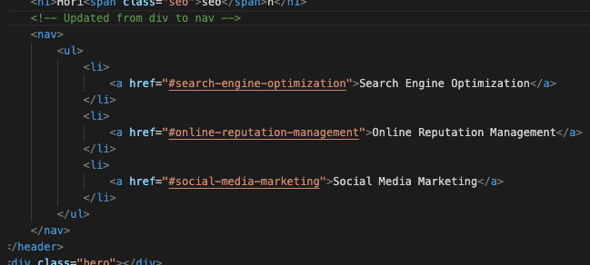
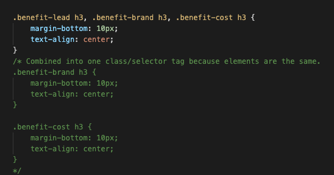
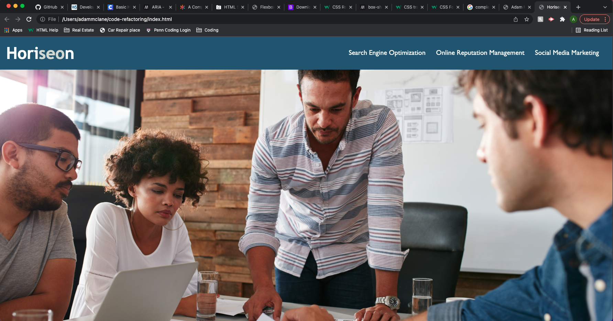

# code-refactoring

## User Story ##
#use my words
For this homework, the marketing agency wants me to update their code for their website to make it follow accessibility standards.  We do this to help their site to be optimized for search engines.

## Project about ##
This project we had to find what can be updated in the html and css to make it more accessable.  We also cleaned the code up to for better practice in coding.

## Acceptance Criteria ##

GIVEN a webpage meets accessibility standards
WHEN I view the source code
THEN I find semantic HTML elements
WHEN I view the structure of the HTML elements 
THEN I find that the elements follow a logical structure independent of styling and positioning
WHEN I view the icon and image elements
THEN I find accessible alt attributes
WHEN I view the heading attributes
THEN they fall in sequential order
WHEN I view the title element
THEN I find a concise, descriptive title

## Github URL ##
https://mclanea92.github.io/code-refactoring/

## Screenshots
This image shows some pieces of the code that were changed to make it more accessible (div to nav)

This image below shows how combining classes and ids in css can be benefical to make clearer and seamless code.

Below is a screenshot of the page at the end of the changes.  No changes made from before visually but refactoring helped accessiblity and cleaning up some of css code to be cleaner.

